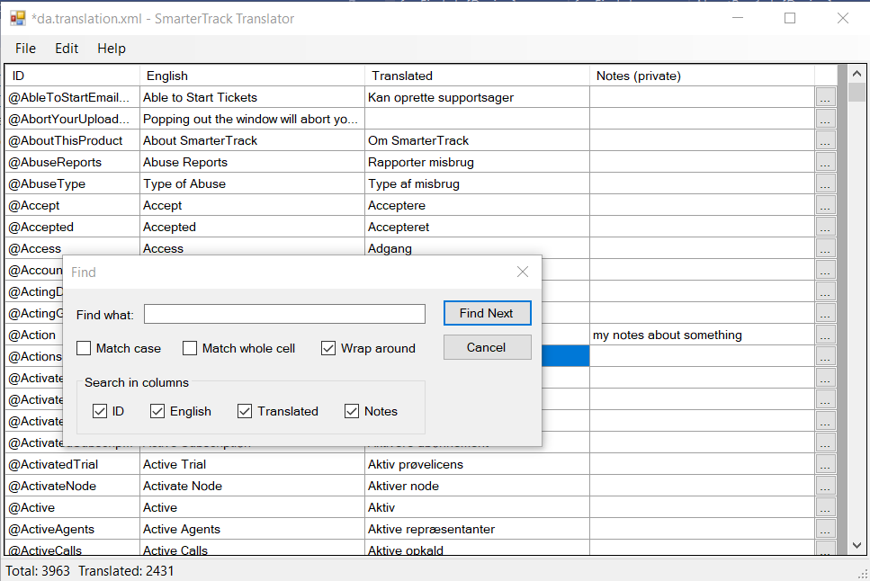

# SmarterTrack Translator

A Windows desktop tool for creating and updating translation files (for UI internationalization) for [SmarterTrack](https://www.smartertools.com/smartertrack).

Lists English and translated items a side-by-side for easy reference, has a search function, and a helper dialog for multi-line items.

Using this tool, rather than editing the XML file directly, makes it easier to keep track of which items have been translated and which have not (the Translation column is empty for those that have not).

Also, whenever a new version of SmarterTrack is released, this tool makes it easy to spot new items that need to be translated. Simply load the new "en.xml" file, load the old translation file, and instantly new items will stand out in the list (Translation column empty).

## How to use?

- First load in the English version (File menu / Open English) using the "en.xml" file from your SmarterTrack web-site. This gives you a table where the "ID" and "English" columns are filled in, and the "Translated" column is blank.
- Next, fill in the cells in the "Translated" column one by one. For single line items (most items), you can edit the translated value directly in the table (double click cell or just start typing). For multi-line items, click the "..." button to open item in a separate dialog.
- Save your work (File menu / Save Translation).
- And finally, generate a new language translation file for upload to your SmarterTrack web-site (File menu / Save Combined).

The "Save Translation" function generates a file which only contains the entries that have been translated. Entries where the "Translated" column is blank are not saved. The "Save Combined" function generates a complete translation file which can be uploaded to your SmarterTrack web-site. For entries where the "Translated" column is blank, the English version is used instead.

You should always keep a separate "Save Translation" file version of your work.

When you want to continue your work later, you always first "Open English" (using the current "en.xml" version from your web-site), then "Open Translation". This will match up English and translated items based on the ID column.

## How to install

Make sure you have .NET Framework v. 4.8 installed / enabled on your computer.

Download and run SmarterTrackTranslator.exe from https://github.com/jesperhoy/SmarterTrackTranslator/releases

## Dependencies 

- .NET Framework v. 4.8

## Versioning

This project uses [Semantic Versioning](https://semver.org/).

## Contributions

Contributions are most welcome. No contribution is too big or too small.

Fork this repository, clone locally, make your updates, commit, push, create a pull request in GitHub...

## License

This project is licensed under the MIT License - see the [LICENSE](LICENSE) file for details

## Acknowledgments

- Thanks to [SmarterTools](https://smartertools.com) for making SmarterTrack.